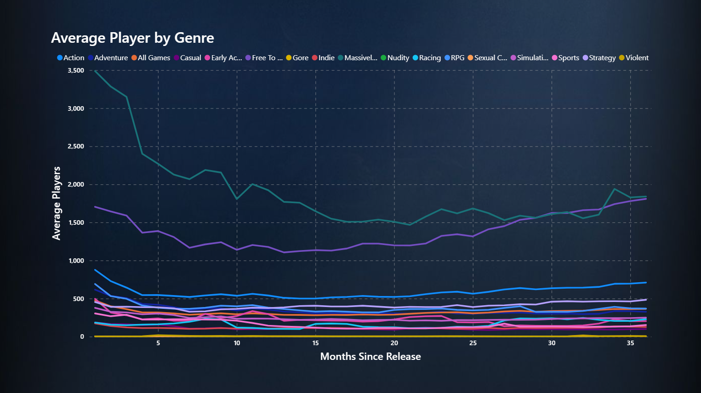
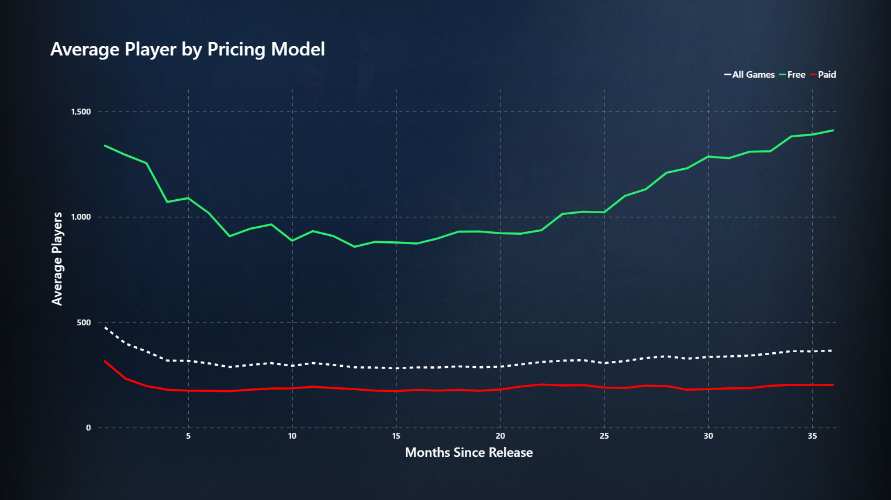
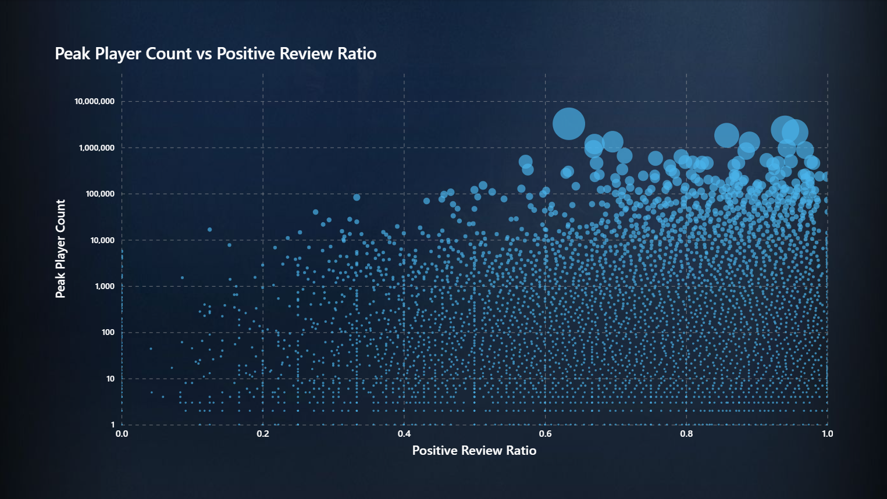

# Steam Game Analysis

A data analysis project exploring trends in player numbers, game genres, pricing, and reviews on Steam. This project combines API data retrieval, data cleaning, relational database management, and visualization to study patterns in game performance over time.

---

## Project Overview

The goal of this project is to analyze trends in Steam game player counts, considering the influence of:

- **Genres**  
- **Pricing**  
- **Reviews**  

By combining multiple data sources and performing a structured ETL process, this project aims to identify patterns such as growth phases in free games and drop-offs in paid games.

---

## Data Collection

Data was collected for **~140,000 Steam apps**, with detailed information on player counts for **~26,000 games** from release to the present.  

### Sources

1. **Steam Store API** – for game details and review data.  
2. **SteamCharts** – for historical player counts (scraped).

### CSV Output

Python scripts were used to fetch and save data as CSV files with the following structure:

**app_details.csv**

| Column | Type | Description |
|--------|------|-------------|
| appid | int | Unique Steam app ID |
| name | str | Game name |
| type | str | Fixed to `"game"` |
| is_free | bool | True if game is free |
| coming_soon | bool | True if game not yet released |
| release_date | str | Release date |
| price | int | Price in cents (e.g., 1200 = $12.00) |
| recommendations | int | Number of recommendations |
| developers | str | Developers (multiple separated by `;`) |
| publishers | str | Publishers (multiple separated by `;`) |

**app_genres.csv**

| Column | Type | Description |
|--------|------|-------------|
| appid | int | Steam app ID |
| genre_id | int | Genre ID |

**app_categories.csv**

| Column | Type | Description |
|--------|------|-------------|
| appid | int | Steam app ID |
| category_id | int | Category ID |

**genres.csv**

| Column | Type | Description |
|--------|------|-------------|
| genre_id | int | Unique genre ID |
| description | str | Genre description |

**categories.csv**

| Column | Type | Description |
|--------|------|-------------|
| category_id | int | Unique category ID |
| description | str | Category description |

**app_reviews.csv**

| Column | Type | Description |
|--------|------|-------------|
| appid | int | Steam app ID |
| num_reviews | int | Number of reviews (0–20; discard this) |
| review_score | int | Score from 1–10 |
| total_positive | int | Total positive reviews |
| total_negative | int | Total negative reviews |
| total_reviews | int | Total reviews |

**app_players.csv**

| Column | Type | Description |
|--------|------|-------------|
| appid | int | Steam app ID |
| month | str | `"YYYY-MM"` format |
| avg_players | float | Average players |
| gain | float | Monthly gain |
| percent_gain | float | Monthly percentage gain |
| peak_players | int | Peak players |

---

## Tech Stack

- **Python 3** – data retrieval and processing  
- Libraries: `requests`, `pandas`, `beautifulsoup4`  
- **PostgreSQL** – database storage and transformations  
- SQL scripts for ETL

---

## Database Structure

The project uses a PostgreSQL database with **three schemas**:

1. **staging** – raw CSV data imported from Python scripts.  
2. **core** – cleaned and normalized tables, including price conversion and many-to-many relationships for genres and categories.  
3. **analytics** – views for analysis, optimized for visualization in Power BI.  

---

## ETL Pipeline

1. **Data extraction**  
   - Run `GetGameList.py` with your Steam API key to retrieve app IDs.  
   - Use subsequent scripts to fetch game details, reviews, and player data using app IDs.

2. **Data loading**  
   - CSV files are loaded into the **staging** schema.

3. **Data cleaning & transformation**  
   - Normalize many-to-many relationships for genres and categories.  
   - Convert price to dollars/cents.  
   - Remove invalid or incomplete data.

4. **Analytics preparation**  
   - Create views in **analytics** schema for use in Power BI visualizations.

---

## Results

The analysis revealed several interesting trends in Steam game player counts:

1. **Average Players by Genre**  
   - Most genres show a tendency for player count to sharply decline after the first few months with `"Massively Multiplayer"` showing a stronger tendency than others.
   - `"Free To Play"` is the only genre to be able to recover player numbers to near launch levels.
   - 

2. **Average Players by Free vs Paid**  
   - Free games tend to have a **second growth phase** after their initial release.
   - Paid games often maintain roughly the same level after the first few months.
   - 

3. **Average Players by Price Range**  
   - Games with higher prices tend to lose players faster after release.
   - Higher priced games showed spikes in player count around the one, two, and three year mark.
   - 

4. **Positive Review Ratio vs Peak Player Count**  
   - Games with higher positive review ratios generally have higher peak player counts.  
   - Game with some of the highest peak player count tend to correlate less with positive review ratio.
   - 

These results highlight the influence of genre, pricing, and reviews on player engagement and retention over time.